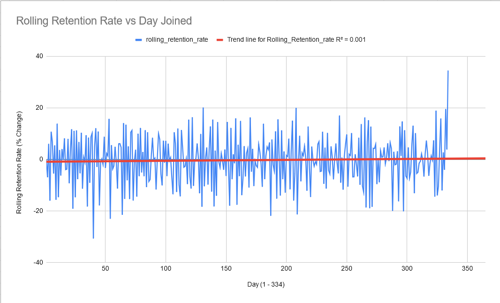
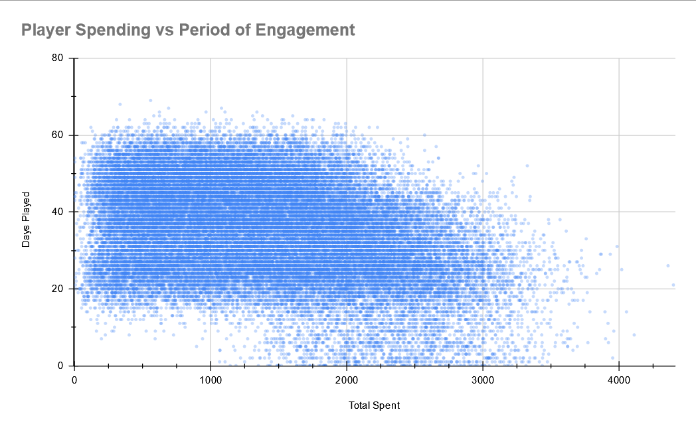

# Project 1: Rolling Player Retention in Game Company over 1 Year

## Queries ([Raw Query Text](https://github.com/VictorSilvano/Data-Analytics-Portfolio/blob/main/SQL-Project/sqlQueries.txt))

For this project 2 seperate quesries were used, both of which were created with the intent to bring the data into Sheets so we could make charts to Visualize the data. The first to create a table with the 30 day rolling retention rate and the second to illustrate the relationship between player spending and their engagement with the game (time between when they joined and played their final match).
	
The data provided to us showcased a game where 2 players played against one another, there were also vasrious in agme services and products available for each player to purchase. After my partner (Elena Fedotova) and I investigated the data we realized every match was duplicated, one where player A was the host and again with player B as the host, this meant that no aggregation across the opponent_id and player_id was necessary as every distinct player was recorded in te player_id,.
	
1. In order to acquire the rolling retention rate, a series of 4 nested and the final statements were used. The first joined the "Matches" & "Player info" tables on player_id. The second was used to create a "retained" check which in this case was if a given player played a game 30 days after creating their account, the third nested query calculated the fractional retention which was then lagged in the subsequent query so the final Select statement could calculate the rolling retention.
	
2. The second query was used to calculate the total amount each player spent, alongside specific details about a given player, age, location, join date and final day engaged with the product. Although we only needed the amount spent per player and how long they engaged with the game we felt it important that the table made had the ancilliary data in case further investigations were necessary. Initially we tried to use multiple joins across the 4 providede tables but were unable to produce the required result. Upon further analysis we decided a WITH query would eb able to satify out requirements. Using "WITH" allowed us to source from 2 temporary tables: total_s and player_info_with_days_played combining these gave us a table that we could use to create our visualizations. 

	
## Visualizations
	
All the visuals were made in Google Sheets.
	
	
	
1. A line chart was used to track the movement of the rolling rentention rate throughout the year. The visual for Rolling Retention was curated, all days between 334-365 were removed since retention of said days could not be accurately measured. Retention of a player is only achieved if they play a match on the 31st day after their account was created which cannot be decided for those players who joined within 30 days of the final day for which data was provided.Although there seems to be little correlation in the data there does seems to be a slight upward trend, but the vast majority of the retnetion is within the bracket of: -20 to 20 with only 13 days excedding either side of this envelope.

	
		
2. A scatter plot was used to track the spending habits vs their period of engament (last day played - the day the joined) of every single player. Initially this graph was one block of data points as the density and overlap were too high to really discern any insights, however after lowering the opactiy and pizel size of each point its much easier to see where every player lands and where stronger trencds are present. Most players did spend money on the game (only 9 players did not spend anything) with most spending between 250-2000 and played between 20 and 60 days. There is also a block of players that although did not engage with the game long term (sub 20 days) were willing to spend upwards of 1500. Somthing to note, if a player played for more then ~40 days they were less likely to spend over ~2250.

